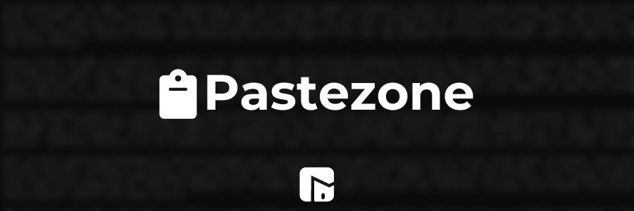

<h1 align="center">
  
</h1>

**Pastezone** is an easy-to-use, lightweight online text editor.

> **⚠️ IMPORTANT**: Pastezone saves contents of text to your browser cookies. If you clear your browser's cookies, the text will be deleted. Pastezone is mainly for temporarily storing text, as opposed to a permanent solution.
## ✅ Usage
<b>🌐 Online: </b> [Click here to go to the online editor.](https://itsfoxdev.github.io/PasteZone)

## 🗺️ Roadmap
- [ ] .txt export
- [ ] Offline HTML
- [x] Word counter
- [x] Text to speech

## ℹ️ Information
Commit icon guide:
- `⬆️` = Uploaded a file
- `🎉` = Major update
- `🐛` = Bug fix
- `🚧` = Test update

- `🏷️` = Text/label edit
- `📦` = 
